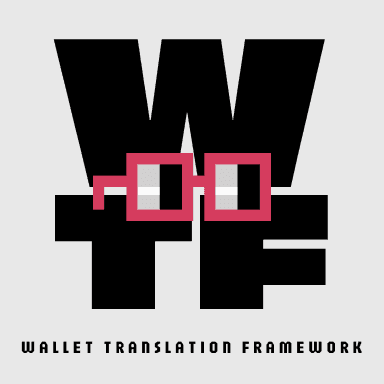
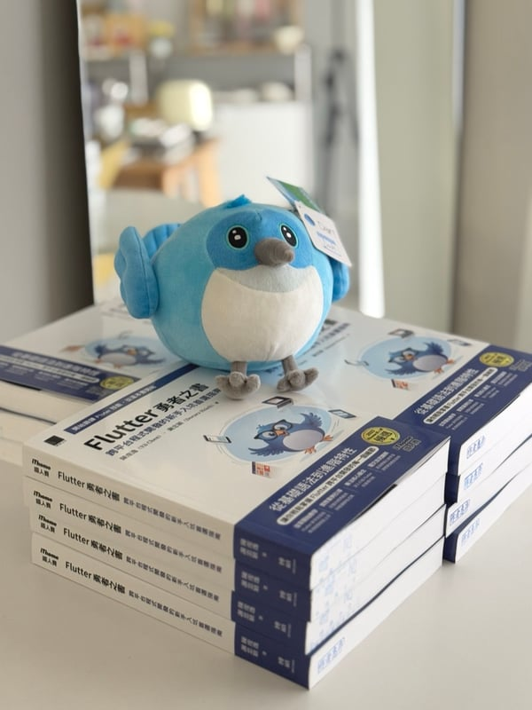
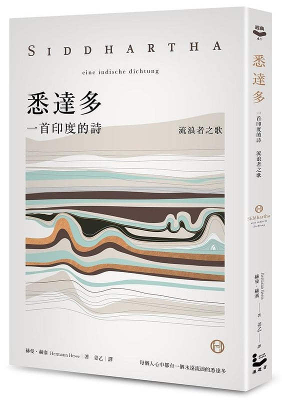
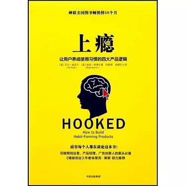
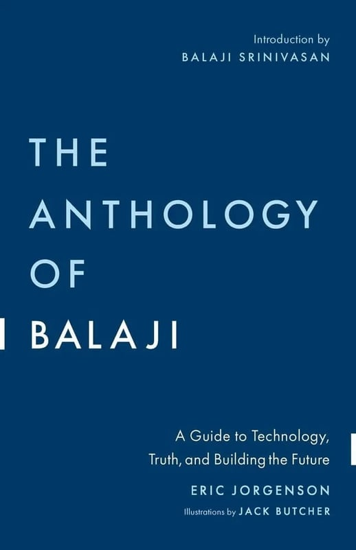
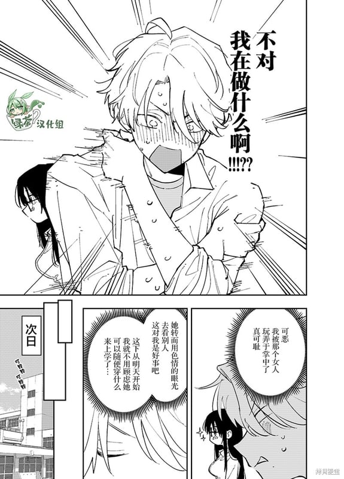
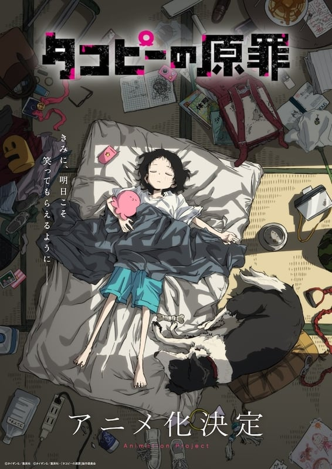
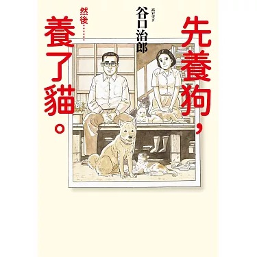

import { YouTube } from 'astro-embed';

**⭐ 今年流水帳總結：**

### March：ETH Taipei｜🥷 Kage Pay

> 🏆： Finalist、Zircuit、Linea、以及 Circle 四項大獎 😍
> 
> 🌐：[Kage Pay](https://taikai.network/ethtaipei/hackathons/hackathon-2024/projects/clu3z5q8a0iq4wc01x67g2mh3/idea)

Kage Pay 是一個專注於解決區塊鏈面對面支付問題的項目。"Kage" 在日文中是影子的意思，代表著我們希望為用戶提供隱私保護的支付體驗。

查看技術細節

主要解決四個核心問題：
- 通過隱匿地址（Stealth Address）保護用戶資產隱私
- 使用 UTXO 模式實現多錢包餘額整合支付
- 採用 Token Paymaster 讓用戶可以用 USDC 支付 gas 費
- 整合 Circle 的跨鏈轉帳協議（CCTP）實現一鍵跨鏈

<YouTube id="eUH8Hrw4laE" />

### April：FlutterxGlobal Gamers Challenge｜Better World

> 🏆：🥇 Best Integration 1st Place
> 
> 🌐：[Better World](https://taikai.network/ethtaipei/hackathons/hackathon-2024/projects/clu3z5q8a0iq4wc01x67g2mh3/idea)

Better World 是一款專為兒童設計的環保教育遊戲。透過垃圾分類、節能減碳等互動小遊戲，讓孩子在遊玩過程中學習環保知識。

遊戲特色

- 結合 AI 技術的實物掃描功能，幫助識別可回收物品
- 收集瀕危動物卡片，提升野生動物保育意識
- 支援多平台（iOS、Android、Web、macOS）
- 整合 Google Wallet，將遊戲成就轉化為數位收藏品

玩家在遊戲中獲得的獎勵可以捐贈給實際的環保組織，讓虛擬遊戲與現實環保行動緊密結合。

<YouTube id="afh4jGIhhEg" />

### August：日本遠端兩個禮拜

這次我們是多位同事住在同個屋簷下兩個禮拜，一起工作，一起吃飯，一起玩。好像是畢業以後，第一次跟這麼多好朋友一起住這麼久。可能未來一段時間內也不會有這樣的機會了，所以格外的珍惜。有人說四十歲以後的人生就是不斷在失去，對於這些難得的體驗確實有這樣的感覺呢。

不知道是不是因為過程很快樂的原因，所以覺得日本真的是一個好地方。好想再去一次啊。

借放一下來自好同事的影片：
<YouTube id='cwmqP3r0TfE' />

### August：ETH Tokyo｜ONI-CHAN
> 🏆：🥇 Finalists of #EthTokyo hackathon 2024.
> 
> 🌐：[ONI-CHAN](https://app.akindo.io/communities/RDo68AZVVs61q8V1V/products/63z0R3MWNF3JEpaL)

ONI-CHAN 是一個創新的場外交易（OTC）協議，專注於解決傳統場外交易中的信任問題。透過零知識證明技術，用戶只要完成法幣轉帳（如銀行轉帳或 PayPal），就能立即從智能合約中領取購買的加密貨幣，無需等待賣家確認。

有趣的是，"ONI-CHAN" 其實是 "onchain" 的重組字母，完美呼應了這個協議的鏈上特性。

<YouTube id="QzMnfdNgjqY" />

### November：ETH Bangkok｜WTF: AI+Wallet
> 🏆：❌ 共估
> 
> 🌐：[WTF: AI+Wallet](https://ethglobal.com/showcase/wtf-ai-wallet-sjmyx)

WTF 是一個結合 AI 的加密貨幣錢包框架，讓使用者可以用自然語言來進行交易。

主要特色

- 支援自然語言處理的交易指令（例如：「轉 100 USDC 給 Alice」）
- 跨鏈支援（Base 和 Ethereum）
- 智能 gas 費優化
- 支援 Flutter 移動應用和 XMTP 訊息系統
- 實時交易監控和狀態更新

透過 AI 技術，WTF 讓區塊鏈互動變得像日常對話一樣簡單直觀。

> 到曼谷的第一天，因為誤信印度室友的餵食，吃了味道像是黑胡椒醬加上沙茶還有一包茶葉不小心被倒進去的早餐，導致我上吐下瀉，整個人非常不舒服。甚至是離開曼谷的最後一天，仍舊逃不過魔爪，我跟同事又在飯店裡上吐下瀉，太迷幻了。唯一的體驗大概就是在當地抽了大麻...

### December：成為作家出書啦｜Flutter 勇者之書

與 Yii 一起籌備的書籍，終於在十二月上線了。在去年參加鐵人賽後，就有出版社聯絡我，希望我寫一本書籍。當時我覺得自己寫的東西還不夠成熟（也不想太累 😌），所以婉拒了。但是今年在 Yii 與出版社的鼓勵下與邀約下，我們決定一起寫一本書。過程中我必須說，我非常感謝 Yii 的鼓勵，因為我對於寫書這件事的熱情，遠遠不及他。我會說都是有他的推動，我才能完成這本書。並且他也在過程中給了我很多的建議，讓我學習到非常多。

在這裡無情工商一下，有興趣的朋友可以到博客來、天瓏書局購買哦。
這本書不只帶你入門 Flutter，更要培養你成為一位具備全方位視野的工程師。

適合以下讀者

1. 想學習最新 Flutter 開發實務，覺得市面上教材已過時
2. Mobile 開發新手，或正在尋找完整學習路徑
3. 準備面試或想晉升 Senior 工程師
4. 想深入理解 Flutter 架構與進階開發技巧

- [博碩](https://www.drmaster.com.tw/Bookinfo.asp?BookID=MP22460)
- [博客來](https://www.books.com.tw/products/0011008795)
- [天瓏書局](https://www.tenlong.com.tw/products/9786264140355)

### December：來搞個 Meme 幣吧｜Dweam

在 2024 年 12 月，我和好朋友 PP 一起搞了個 Meme 幣，叫做 Dweam。他是個以夢想為主題的 Meme 幣，我們希望透過這個幣，讓大家能夠更了解夢想的重要性，以及夢想的力量。Dweam 是來自外太空的未知生物，他們的語言是夢想，他們的行動是夢想，他們的思考是夢想。在 AI Agent 的加持下，Dweam 會變得更加聰明，並且能夠透過夢想來實現任何願望。

現在只是個還在起步的項目，切勿投資。✨✨✨

- [twitter](https://x.com/dweambig)
- [website](https://dweam.xyz)
- [pump.fun](https://pump.fun/coin/4hGYiv6w7SyNXjASvVFoG9XTiAtjiTWmf4krcp2apump)

## ⭐ 今年最受用：**長期主義**

今年年初最想改變的是自己的滿足感來源，很多時候得不到滿足感並不來自於你不夠努力，而是你不肯定自己，但肯定自己不是容易改變的事，因為你要改變對自己的看法。我認為難處分為兩個層面：**一是你對於自己的價值感過低，二是你對待事情的預期過高**。

我比較想談的是第二種，對事物的預期管理。因為我屬於對自己價值感過多的類型，在開始之前會抱有過高的期待。而過高的期待來自於：**對事情的進展以及對於自己的能力過於樂觀**。當然任何事情在發生之前，都必須保持樂觀，否則根本沒有勇氣去面對。但是如果一直保持過度樂觀，反而會在事情稍有不利時，傷害自己的心，進而讓自己感受到傷害或者喪失信心，所謂爬得越高摔得越重嘛。如何保有客觀的預期，以利於讓自己保持長期的熱情，和對事物相對高位的滿足感，就是我想談論的議題。

最近有個很紅的名詞叫做成長型思維，講的是相信學習能夠改變，要擁抱挑戰並且關注過程而非結果，內容我都很認同，不過這個名詞在很多 **"心靈成長"** 類的平台已經被過度濫用，而且成長型思維總讓我覺得有種 PUA 的臭味 。我認為更合適的名詞應該是：**長期主義。** 長期主義個詞，在思考上會直接暗示你應該以更宏觀更抽像的角度來思考問你要面對的事物，並且相信累積與過程。表達的內涵相同，但是語言上更具有魔力（語言是真的有魔力的 🧙‍♂️）。

走向長期主義者的路上，我還有許多方面需要學習，但我可以說說最近很有感的例子：今年下半年決定開始學習日文，學習語文一直是我每年都會想許下但是永遠無法達成的願望。但在身為長期主義者的自我認同下，我先去是去解了我想要達到的語言程度大概要花多少學習時間（700~800 小時），這讓我對於自己應該要付出的多少努力有一個大概的了解，避免在途中才發現原來要花比自己預期更久而感到無力。也可以在過程中感受挫折時，有一個進度條隨時檢視自己的進度。如果覺得自己程度太差時，不會去責怪自己反而是有動力加緊努力達到 700 小時的目標。

## ⭐ 今年最愛電影 《與夢前行 宮崎駿》（Hayao Miyazaki and the Heron）

這是一部關於吉卜力，但不是吉卜力的電影。追蹤拍攝宮崎駿七年的紀錄片。過程中你會訝異於這位年過八旬的老人，居然還能活躍於動畫電影的第一線。他可不是坐在椅子上指揮，而是親自繪製角色、電影分鏡、甚至動作設計，這些可都是體力活啊！在過程中會感受到製作電影的種種辛苦，這種辛苦對他本人而言，甚至是一種折磨。除了製作電影之外，因為是長時間的跟拍，所以可以近距離的接觸宮老爺子對於自己的省思，和身邊友人的一個個老去離世，感慨生命稍縱即逝，甚至開始想向自己的死亡。

但這其中最觸動我的莫過於看到一位老頭子，坐在狹小的書桌前，重複說著：好難啊，我做不到。時而垂頭喪氣，時而怨天尤人。完全沒有想像中大師的處之泰然，反而像是我們一般人，有著對現實與壓力帶來的窘迫與無奈。這反而讓我大大鬆了一口氣，我一直認為追求內心平靜與和平，用近禪宗的態度才能過好人生。但宮崎駿給了我另一種想像，即便是到老了也可以放任自己的內心衝突，從各種矛盾中體驗創作與人生的意義。

> 毫不誇張地說，電影超過三分之一的鏡頭都是宮崎駿抱頭說：好困難啊，我做不到。

## ⭐ 今年最愛動畫電影《驀然*回首*》（ルックバック)

<YouTube id="TgUhxA_r8lw" />

---

在動畫黨與漫畫黨的抗爭中，一直是漫畫派。但這次我必須說我輸了，怎麼這麼好看！！！驀然回首是天才漫畫家、天才分鏡師、天才短篇王：藤本樹最有名的短篇了。頁數只有 143，不用半小時就能看完的作品但卻能讓人回味無窮。在這裡就完全不暴雷了，勸敗必須看，這是寫給追夢者和獻給青春的故事。藤本樹非常擅長捕捉細膩的情感變化，並且用鏡頭的語言帶給每一位觀眾。原本漫畫已經足夠驚艷，但在導演 **押山清高** 的巧手下，把分鏡裡的情感都完整展現甚至因為音樂和動作演出，讓整部作品的情感更加飽滿。每看必哭！！

## ⭐ 今年最愛書籍

### 馬斯克傳
《馬斯克傳》由傳奇傳記作家 Walter Isaacson 執筆，延續他在《喬布斯傳》中細膩描寫天才人物的筆法，將馬斯克這位今年最炙手可熱的創業家描繪得淋漓盡致。如果你已對馬斯克的故事耳熟能詳——從他奉行的第一性原理，到他與多任妻子間的戲劇性關係——這本書的內容或許不會帶來太多驚喜。然而，Isaacson 的視角與文字功力，讓這部傳記成為一本值得反覆品讀的作品。

書中深入探索了馬斯克的性格、決策背後的驅動力，以及他如何影響我們的未來科技與生活。即便你認為自己對馬斯克已瞭如指掌，Isaacson 的筆觸將帶你進一步感受這位天才的複雜與非凡。

### 悉達多
《悉達多》是德國作家赫曼·赫賽以哲學思辨為筆，融匯印度宗教與文化而創作的經典小說。這本書以印度哲學為背景，但透過德國人特有的理性與存在主義視角重新詮釋，展現了東西方思想交融的深度與張力。悉達多的追尋之旅不僅是靈性的探索，也折射出赫賽對個人自由與生命真諦的哲學思考，是一部東方靈性與西方哲學對話的文學傑作。

### 上癮
《Hooked: How to Build Habit-Forming Products》是一本極度實用的書籍，特別適合正在開發產品或從事創新設計的人閱讀。由 Nir Eyal 和 Ryan Hoover 合著，這本書深入探討如何運用心理學的原理設計出讓用戶形成習慣的產品。

書中提出的「Hook 模型」是一個循環的四步驟框架，幫助你理解如何吸引用戶、激發動機、創造回報並形成持續使用的習慣。無論是你在構思新的產品創意，還是想審視目前產品的不足之處，這本書都能提供實用的切入角度，讓你重新思考產品設計中的用戶心理。

這不僅是一部理論性讀物，更是一個實際操作指南，結合真實案例與清晰的分析，讓讀者能夠立即應用到自己的工作中。對於希望打造「讓人欲罷不能」的產品設計者，這本書無疑是一個強大的工具。

### 巴拉吉預言
《The Anthology of Balaji》 by Eric Jorgenson 是一本讓讀者彷彿與 Balaji Srinivasan 進行深刻對話的書。它彙集了這位傑出的企業家、工程師、投資者和未來學家的思想精華，充滿挑戰性、前瞻性與啟發性的觀點。無論你是否完全認同書中的內容，這本書都會激發你思考新觀點，並以全新的方式看待世界。

書籍分為三個主要部分：

- 1️⃣ 科技的力量：探討技術如何改變我們的生活，並展望未來科技的潛力。
- 2️⃣ 真理的本質：分析不同類型的真理，幫助讀者建立自己的思考框架，學會如何評估想法。
- 3️⃣ 構建未來：提供 Balaji 的實用建議，涵蓋創建公司、協議、非營利組織、專案甚至數位國家的策略。

Eric Jorgenson 透過整理 Balaji 過去十年中在 Blog、文章與推文中的智慧，將這些洞見串聯起來，讓讀者在短時間內就能掌握 Balaji 最具價值的觀點與建議。

這本書不僅僅是一部指南，更是 Balaji 所描繪未來世界的地圖與藍圖。它適合任何想了解技術、真理與未來建設的人，是一部值得反覆品味的啟發性作品。

## ⭐ 今年最愛漫畫

### 坐在旁邊的傢伙，用那樣的眼神看著我... (となりの席のヤツがそういう目で見てくる...)
坐在旁邊的女同學，老是用下流的眼光看我，好討人厭可是莫名的好喜歡。

### 章魚嗶的原罪 (タコピーの原罪)
外星人章魚嗶，使用高科技來幫助人類。但是科技沒辦法解決人性的缺陷，還可能越幫越忙...

### 先養狗，然後……養了貓。 (犬を飼う そして…猫を飼う)
孤獨的美食家的作者另一部經典，以細膩的筆觸描寫人與動物之間的真實情感。

## ⭐ 今年最愛音樂

### 純音樂

平靜的氛圍中，又能默默地挑撥你的情緒。坂本龍一永遠的版本答案，老師 R.I.P
> [**Merry Christmas Mr. Lawrence**](https://www.youtube.com/watch?v=MxPdn6jJMMQ&t=597s)

從股癌的頻道中挖到的寶據說是寫給植物聽的歌。魔幻又令人舒服的音樂，需要親自體會
>[**Plantasia**](https://music.youtube.com/watch?v=LkesIsPGlSU&si=wxK95dyS4Ph5KaDv)

暮然回首的配樂，是一首聖歌。雋永的氛圍意外地適合出現在這個定格青春的電影裡。
>[**Light song**](https://www.youtube.com/watch?v=dnHpo1CVbLg)

### 台語歌

從董認識到**潤少**，但我發現**刺到整身軀**讓我更愛，把刺青文化跟街頭少年的傲氣性格刻畫的很好，歌詞絕對是上上品。（剛剛為了找連結，又聽一次實在太爽）
> [**刺到整身軀**](https://www.youtube.com/watch?v=DEiHTt6TGOg)

### 國語歌

陶喆的經典歌曲，現在來聽還是經典，味道還在。甚至因為時間反而讓他更顯得出眾。
> [**找自己**](https://music.youtube.com/watch?v=xG0waEXWUKk&si=Dgd6fbqx2JPCA6Zt)

歌詞寫得真好，第一句："很討厭吧 這樣說會讓你為難吧"。把戀愛中的卑微感描寫的細緻深入，非常喜歡他們切入戀愛的角度。
> [**能不能請你別把我丟下**](https://music.youtube.com/watch?v=ASkbJvFokkY&si=9GhGBKo66woMysBc)

在這個做表面的時代，創作是不是也變得不夠純粹？當代電影大師帶來我知道你不敢聽，對創作者最深的靈魂拷問。
> [**我知道你不敢聽**](https://music.youtube.com/watch?v=2-gIsJhP2QQ&si=0XQsfBLU_o1xDWlR)

### 日語歌

真的很抱歉，今年才認識 Vaundy。00 後才華洋溢的創作者，旋律太抓耳有者復古加上迷幻的感覺，天才就是在形容這樣的人吧。
> [**踊り子**](https://music.youtube.com/watch?v=CnlMTBwsBHs&si=uW-Dw4z6KMDMNpZy)

又是一位 00 後，年僅十八歲的 AKASAKI 創作的歌曲，日本的高中生都不是人。非常抓耳的旋律，勾勒出戀愛的浪漫氛圍。
> [**Bunny Girl**](https://music.youtube.com/watch?v=_GXbXU4g_CA&si=DebAPGtWDTLwGM1L)

洗腦的前奏，以及明確的節奏。各國都瘋 Remix 自己的版本，喜歡的話把各國都找出來比較一下吧。
> [**チーム友達**](https://www.youtube.com/watch?v=c1UaGJlsw5g)