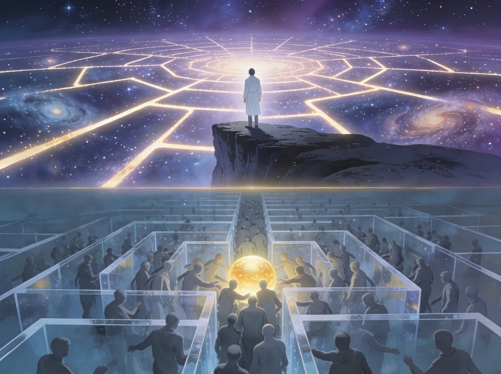
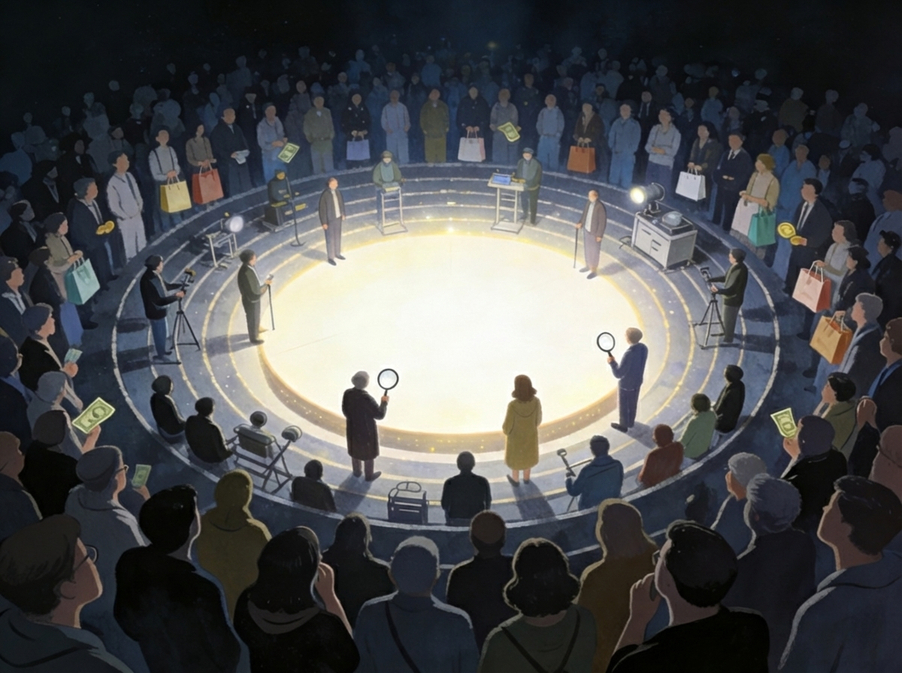
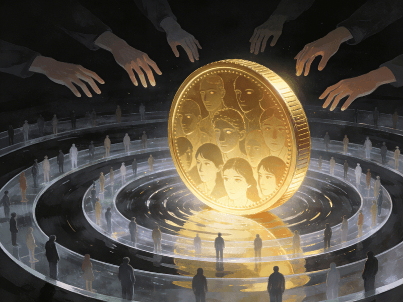
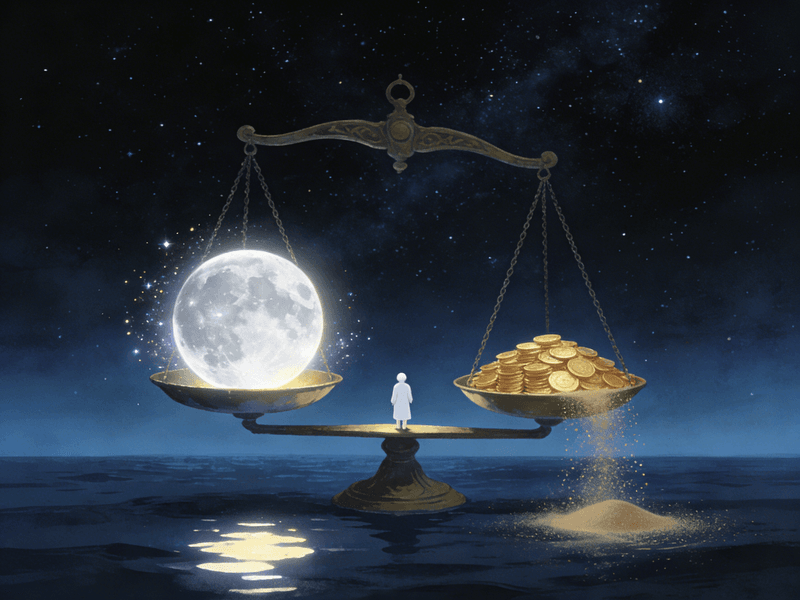

import ZhiJianToggle from '~/components/zhijian/ZhiJianToggle.astro'

世界上有兩種困難，一種是面對無限種可能性的「創造困難」，一種是面對有限性的「競爭困難」。

為什麼會有這兩種困難，以及我們該追求哪一種？

本篇的內容多來自於「湯質看本質」的《[給未來孩子的信：不要圍觀他人的生活](https://www.bilibili.com/video/BV1gB4y147jf/?vd_source=2e87a9fd9127cd1b0f928a4711474a1d)》，如果你對這些內容感興趣，務必去觀看原始影片，收穫會更多。

---

## 一、兩種人

這個世界上只有兩種人：直接的人，和間接的人。

為了方便討論，我們叫他們「直人」和「間人」。

- 直人是遊戲的人、散步的人。把生活當成直接的目的。

- 間人是競爭的人、趕路的人。手段與目的分離，生活中充滿了間接性。他們起初被間接性妨礙，後來卻慢慢享受於此。

其實你很容易分辨出身邊的直人和間人。

在表達的時候，直人關注思想，間人關注口音。拍照的時候，直人關注光影，間人只關注用什麼設備。學習的時候，直人關注知識，間人只關注有哪些學習的工具。

總之，直人試圖進入事物的內核，而間人滿足於在外圍游蕩。

因此間人有很多名號：參數黨、器材黨、周邊控。我們不妨統稱為「外圍黨」。

<ZhiJianToggle />

---

## 二、外圍的誘惑

我們總說「事物事物」，事在先，物在後。內核中的人專注於事、勝於物。外圍的人沉溺於物，結果荒廢其事。

這很荒唐。但這卻是這個世界發展的基本邏輯。

攝影業的發展離不開一群關心攝影機器遠超過關心攝影本身的人。體育業的興盛，也是因為運動裝備是一門巨大的生意。可以說，今天這個世界的繁榮，就奠基於這種間接性和外圍性。

為什麼會這樣？

大概是因為外圍提供了**簡明的評價體系**和**虛假的參與感**，而這兩者恰恰是人們構建自我認同的基本條件。

因此，真正區分內核與外圍的，不是「事」和「物」，而是「難」與「易」。

相比攝影，評價攝影作品是容易的。相比評價作品，比較拍攝設備的參數是更容易的。

越是外圍，人數越多。

---

## 三、層層圍觀

人類社會中有一種層層圍觀的認知模式。

有一個人在創作作品，就有十個人評價作品，就有一百個人研究他們的創作裝備，就有一千個人對評價作品的作品進行評價、對研究裝備的裝備進行研究。然後會有剩下的數以萬計的人，在最外層圍觀這一切。

他們想要參與進去，於是他們**買點東西**。

這種層層圍觀的結構會帶來兩個麻煩。

- **把評論者當成事物意義的最終代言人。**

    評論者相當於高級間人。他們的工作簡化了事物的複雜性。每當普通的間人對現象感到困惑不解的時候，他們就會跑到評論者那裡發問：「如何評價 XXX？」不直面困惑，而是追究「如何評價」、「如何看待」，這是間人構建自己世界觀融貫性的基本操作。

- **把對「物」的消費當成意義實現的最終途徑。**

    直人創造作品，間人解釋作品。解釋本身變成作品的同時，高級的間人就變成了初級的直人。這些作品會供更間接的人消費。更間接的人不甘於此，想要參與進來，只能在物上下功夫。

> 「我成不了某人，但我能和某人吃同樣的食物，用同樣的工具，開同樣的汽車。」

---

## 四、什麼是錢

在內核與外圍中，衍生出了無數的產品，物質的、文化的。這些產品之間的「間」量是不一樣的。原作的價值高於數碼複製品，手工製作物的價值高於流水線的商品。一般來說，越間接的商品就越不值錢。

那什麼是錢？

錢是這個世界上最間接的東西之一。錢居於外圍的外圍之外，是一切產品的等價物，是至間之物。

雖然它起初只是純粹的等價物，卻悖論性地獲得了一種絕對的普遍性和可度量性。一個自身毫無價值的東西，成了價值的載體，成了間人所認同的萬物最清晰的評價尺度和最終極的解釋依據。

錢本來是手段，意義才是目的。但人們把手段（錢）當成了目的，把目的當成了手段（錢）的副產品。

---

## 五、兩種世界觀的戰爭

這個顛倒催生了兩種世界觀的戰爭。

一種世界觀認為，金錢與權力的流轉只是表象，內核是來自於人對意義的追求與創造。金錢與權力，只不過是創造意義時產生的副產品。

另一種則完全相反：什麼藝術作品背後的意義，這些才是表象。驅動這個世界運轉的根本力量，是人對金錢與權力的欲求。這些作品只不過是人類在追求金錢與權力時創造的副產品而已。

- 前一種理性主義的世界觀，稱為「直人世界觀」，也叫「月亮世界觀」。
- 後一種世俗主義的世界觀，稱為「間人世界觀」，也叫「六便士世界觀」。

這兩種世界觀視同水火，互認對方為表層的假象，自己才是底層的本質。

這種對立撕扯著今天的年輕人。有句話是這樣說的：一個人如果在十四歲的時候不是一個理想主義者，他一定庸俗得可怕；如果一個人在四十歲的時候仍然是理想主義者，他又未免幼稚得可笑。

今天的年輕人，在表象與本質、表層與底層的顛倒之中，暈頭轉向，茫然失措。最終被逼無奈，混入了中間的夾層。有時幼稚得可笑，有時又庸俗得可怕。

其實徹底的庸俗之人和理想之人，都有純粹的快樂。唯有活在中間的人是最辛苦的。他們缺乏因篤信而生的勇氣，也缺乏因偏見而起的魯莽。他們是患得患失的機會主義者，總是在權衡利弊，顧此失彼，像被困住的那頭布里丹之驢。

最後的結果是：他們既不具備精湛的技能收割世俗認同的目光，也沒有辦法進入事物的內部轉化自己的生命衝動。他們游走於兩個世界的外圍，只能發表一些評論，或者買一些周邊來自慰。

---

## 六、兩種困難

既然兩者都有純粹的快樂，憑什麼認為某一種快樂更值得追求呢？

前面說，真正區分內核與外圍的，不是事和物，而是難與易。所謂困難，大概是這樣一種東西：當現狀與預期有著巨大的落差，而且這種落差無法被清晰認識的時候，我們會體驗到一種叫「困難」的籠統經驗。

當你在兩個世界中想要穿過層層的圍觀、擠入內核之中時，你會遭遇兩類完全不同的困難。

- **第一類：直人的困難，來自深刻的神秘：無限的困難。**

    一個事物如果永遠無法被徹底地解釋或描述，我們就說它是神秘的。這裡的困難指的是：某項活動既不存在標準的活動流程，也不存在公認的結果評價體系，因而展現出事態的無限可能性時導致的困難。

    例如：當你要寫出一篇好文章的時候，當你想要畫出一幅美麗的作品的時候，或者說想要進入月亮直人世界的內核的時候，你就會遭遇這種困難。這是**無限導致的困難**。

- **第二類：間人的困難，來自膚淺的混亂：有限的困難。**

    某項活動由於參與者都有同樣的目標，因為資源有限而導致的競爭白熱化而產生的困難。比如當你想要中彩票的時候，想要財務自由的時候，想要坐擁香車美女的時候，你就會體驗到那種困難。這是**有限導致的困難**。

六便士世界有一種有限性，它的約束條件決定了大多數人注定是匱乏的。月亮世界有一種無限性，因為某事無跡可循、無計可居，所以人人都有自己騰挪的空間。

由於錢是最外圍的「至間」之物，所以**把金錢當做欲求的目標，其實是選擇了一條最容易走的路**。因為它不涉及任何的自我反思和自我辯證，是我們動物精神的直接延伸。只不過由於人人都如此選擇，它變得非常困難。

逃避直人的困境，就會陷入間人的死局。

吊詭的是，想要在這種有限中追求無限的妄想導致的妄念，恰恰是經濟發展的原動力。

與膚淺的混亂纏鬥，注定了大多數人在大多數時候都會活在挫敗與焦慮之中。但在他們看來，逐利依然是最理性的那個選項。

這裡引出了第二組觀念顛倒：**理性與非理性的顛倒**。

庸眾所認為的「理性」，其實是一種非理性。那些被他們指認為非理性的行為，比如理想主義、追求藝術，恰恰是最理性的選擇。因為經由創造，人人都能在展開自己的同時，不擠佔他人的生存空間。

因此，我們必須直面深刻的神秘，直面無限性的困難。因為它們才是價值與意義的真正源頭。

---

## 七、活在時間裡的人

在你成長的過程中，會有很多人評價你。他們基於你的過去，推斷你的未來。

但這種評價要能運作，有一個前提：你必須是可以被時間切片的。

「十八歲還沒考上大學」「三十歲還沒結婚」「四十歲還在做這種事」——這些判斷之所以成立，是因為我們預設了人可以用年齡來定義，用階段來衡量。

但你真的可以被這樣切割嗎？

時間不是客觀存在的自然之物。它是人類發明的最精密的「間」之工具。有了時間，無限的可能性才能被壓縮成有限的期限，不可評價之人才能被放上評價的天秤。

更糟糕的是，時間讓「當下」徹底失去了獨立的意義。未來被拿來定義現在，而不是現在重新定義未來。

這裡就出現了第三組顛倒，也是最終極的顛倒。**當下瞬間與時間的顛倒**。

時間和金錢一樣，它們以最無辜、最公平的面目出現，先是成了我們衡量一切的尺規，然後成了收容我們欲望的對象。但它們兩者恰恰是一切「間接性」得以成立的根基。

我們錯把最沒有價值的當成最有價值的，錯把最不理性的當成最理性的，錯把最間接虛幻的當成最直接真實的。最終在三重顛倒的合力扭曲之下，人們完成了邏輯閉環。

> 現實世界中所有的不合理，突然都有一種匪夷所思的合理性。

---

## 八、結語

我們都是卡在中間的人，既不是純粹的直人，也不想只做個間人。我感覺自己充其量是個高級間人，嘗試成為其他間間人的初級直人。

其實記錄這篇文章也是想要提醒自己，要不斷地挑戰困難，不要做圍繞在世界外圍的間人。要成為純粹的直人，把生活跟過程就當成目的本身。

> 如果你對這個主題有興趣，可以回看之前寫的：[模仿遊戲](/posts/wittgenstein_ai_language_game)，也是談到相同的模仿慾望會產生有限的競爭，從而導致內卷，也許會帶給你一些額外的啟發。