import AppStoreCards from '~/components/resume/AppStoreCards.astro'
import { YouTube } from 'astro-embed';

## 成為一位 Builder

今年一月的年假期間，在 Threads 上開始了「嘗試不害羞分享自己做過的事 」系列，重新把自己放到 Build in Public 的環境中。最初的設想是想通過分享自己做過的事，來找到一些受眾，並且有機會轉化成商業機會。

雖然以商業角度來看，結果並不是太成功。但是透過與 AI 快速打造網站，快速上線，我大概在一年內做了約 20 多個專案，這是在過去不敢想像的。

上半年先以 Web 為主，因為可以快速上線，快速擴散。下半年則以 App 為主，判斷是 App 的付費習慣更好，後續收入也證明這件事。下面分享幾個，我認為比較有趣的專案：

展開 Web 互動作品

### [衝上台灣新聞的 投胎抽卡機](https://dweam.xyz/luck)

用機率模擬出生地，讓人更直觀地感受生在台灣的幸運與不易，提醒大家珍惜當下。

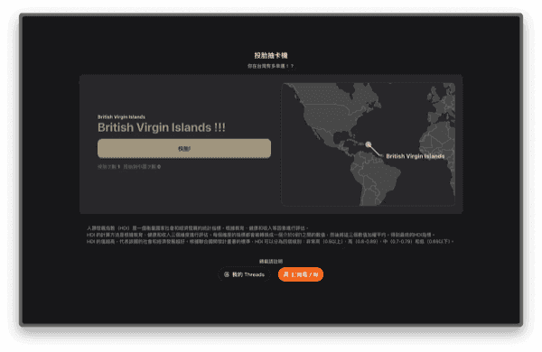

### [用 AI 復刻我心中的小男孩](https://dweam.xyz/voice)

將自我懷疑與孤單的心情轉化為 AI 小男孩，與他對話，探索理解與自我接納的可能性。

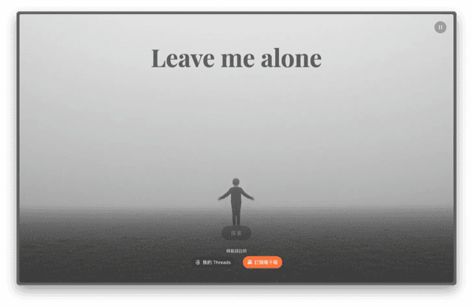

### [你不是在反駁只是在宣洩情緒](https://dweam.xyz/rebuttal)

運用 Paul Graham 的理論，幫助你辨識討論層次，促進更健康的線上溝通，提升社群媒體的討論品質。

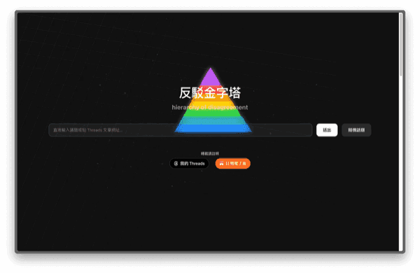

### [WOOP 許願機，找出「動機」你才有「動力」開始](https://dweam.xyz/woop)

運用心理學 WOOP 理論，透過 AI 協助將願望拆解成具體行動路徑，幫助你攻克拖延，實現目標。

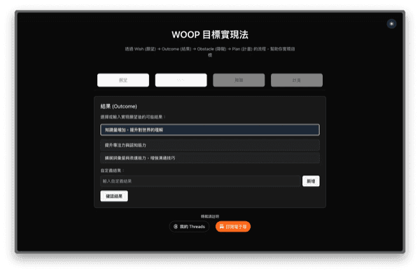

### [男性開腿難題，把捷運上的開腿男都打下去](https://dweam.xyz/mrt)

以「男性開腿」社會議題為靈感，結合可愛小遊戲，希望引起關注與討論，而非說教。

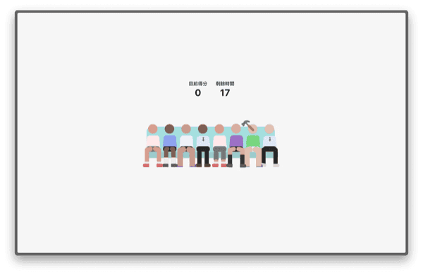

### 上架應用程式

下半年開始嘗試 App 開發，判斷是 App 的付費習慣更好，後續收入也證明這件事。

<AppStoreCards />

### 撰寫文章

一直在思考 AI 時代自己能做些什麼？對於 AI 產生的海量訊息，某種意義上來說是種熵增，所以為了抵禦這個系統風險，必須透過自己的紀錄與創作來保存一些「熵減」。因此開始寫自己的部落格，分享自己在 AI 時代的思考，紀錄下真實的過程。

---

## 一日環台北 YouBike 挑戰賽

在台北工作了大半辈子，從來沒有環台北走過一次，直到在 Youtube 上看到有人挑戰腳踏車環台北的影片。剛好在年底拉著同事一起，完成這個挑戰！總時長約七個小時，歷經 68 公里，順利完成啦！

> 用自己做的 geo tracking app，超級療癒的。[傳送門](https://gpx.dorara.app/editor)

---

## OW 潛水證照

潛水應該是今年最挑戰的事情之一，對於我來說水上運動是抱有恐懼的。我記得在國小的暑假，我花了一整個暑假的時間學游泳，但卻連把頭沉在水中都沒做到（老師應該要退費哈）。

果不其然，第一天，我在水下待超過五分鐘都做不到，無法呼吸的恐懼會一直縈繞在我腦海。晚上立即跟一起同行的女友表示：我一定考不過的 🥲。

考試中最難的是要在水下脫掉面鏡，現在回看影片還是會頭皮麻麻的。

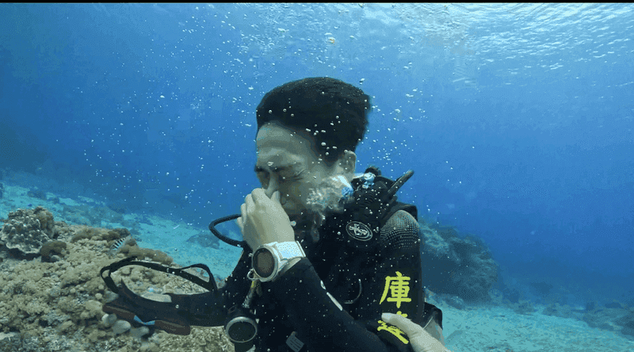

雖然過程中各種挫折，但是在一次次練習，跟著專業教练的指導下，居然真的考過了！！！現在回想起來還是有點不敢相信，居然真的跨越了恐懼的障礙。

> 再次確認自己是被推上去，就會硬著頭皮完成的體質

---

## 爬山：合歡群山與小奇萊

人生第一次挑戰百岳，聽說是最簡單的百岳之一，但是作為一個從沒有接觸過爬山的人來說，是個很有趣的小挑戰。第一天上山有小小的高原反應，感覺暈暈的也很容易喘，在平地上前所未有的體驗。也因為吃暈車藥的關係，整天都昏昏的。

台灣的山真的好美，在寫文章的時候一邊複習照片，真的超級療癒的。

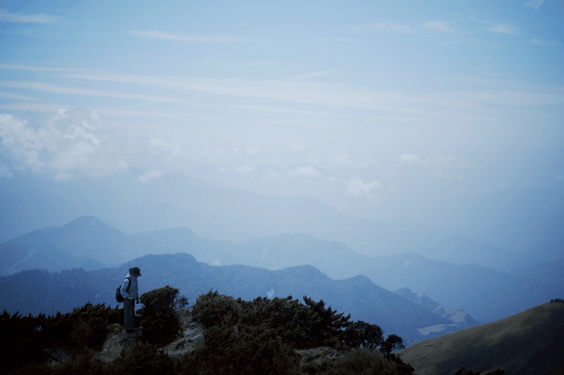

感謝隊友們，幫忙抽到松雪樓，規劃行程也是一把罩，讓我安心當個小廢柴，只需要負責的上山下山。

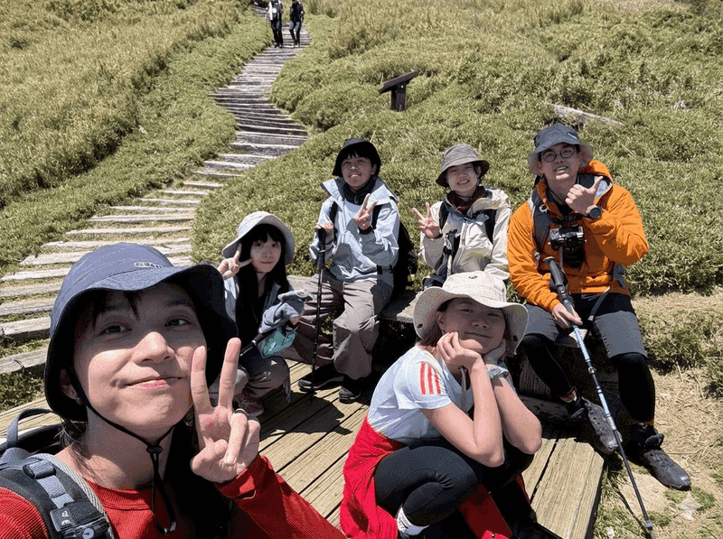

> 小 tips：在山上穿亮色衣服不僅顯眼安全，也超級帥的（下次也想穿亮亮的）。

---

## 異地工作

今年繼續延續自己嘗試遠端工作的夢想，在中歐與越南分別待了一段時間。我很喜歡這種慢慢探索、慢慢認識一座城市的感覺。也許會錯過很多大家喜歡的景點，但是這種真的在城市生活的感受，比起去過哪些景點更讓我印象深刻。

### 金門

詳細記錄在 [金門](/posts/kinmen)。

### 奥地利、匈牙利、捷克

> **🏨 住宿**：因為在要省旅費的緣故，我大多住在青年旅館，價格約在 750 ~ 1000 元/晚，
>
> **🍲 食物**：普遍落在 300 ~ 500 元/餐，為了省錢多數會去找便宜的麵包，室友也很多會自己準備食材回到青年旅館自己煮
>
> 🚇 **交通**：在大城市地鐵都很方便，唯獨如果要透過火車做跨國移動，要有歐洲火車時刻表不準的心理準備。我最多的一次中途延誤了大概 4 小時以上
>
> 🛡️ **安全**：比起西歐地區，感覺中歐還是安全許多

#### 捷克

一落地布拉格，作為首次跨足出亞洲的旅遊來說，這裡的景觀真的讓人驚艷。隨處都是精雕細琢的教堂，建築風格也非常精緻，好像是到了一個童話世界。但這個魔法大概也維持了只有一個星期，你漸漸感受到多數建築像是某種精緻的遊樂設施，真正的古堡其實只有那麼幾座值得令人讚嘆。

> 隨手拍都感覺像是明信片。

雖然這麼說，不過不妨礙我對這個城鎮的喜愛。在捷克的步調更慢，在歐洲也是相對安全友善的區域，所以沒有遊客緊張兮兮的氛圍（雖然我還是買好了防偷腰包）。

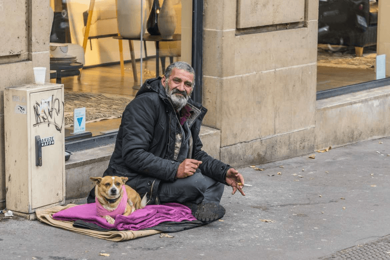

不知道為什麼，歐洲的街友感覺也特別帥。他們多數會帶著狗狗，幾乎是每個人的標配了。

#### 匈牙利

在匈牙利的布達佩斯，原來布達跟佩斯是兩個不同的城鎮，由多瑙河分隔。兩岸的景色都非常漂亮。抵達的隔天立刻在青年旅館內租了一台腳踏車，打算透過腳踏車來探索城市。不得不說，這種方式真的超級有趣，選對了。因為城市的大小很合適，用腳踏車探索讓我玩出一種在現實玩「薩爾達傳說」的感覺。

隨著騎行，會在遠處看見各個教堂或建築物的塔尖，自然而然地引起好奇心讓你想要前去探索，在前往的路上，又會隨時在轉角遇見一些有趣的公園或者店家，真的是超棒的體驗。

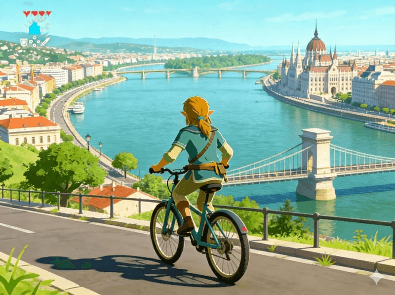

> 如果對薩爾達如何製作這種「探索」開放世界遊戲的方式，歡迎看這個[影片講解](https://www.youtube.com/watch?v=CZzcVs8tNfE&t=8s)

#### 奧地利

最後一站到維也納，這也是我相對比較無感的城市。也可能是一開始對他的期望過高，加上在這些天的經歷，讓我對歐洲的美麗外表「去魅」了一點。維也納的物價也相對比較高昂，所以我待的時間也不夠長，印象最深刻的是在美術館裡面見到了許多只有在課本見到的畫作。

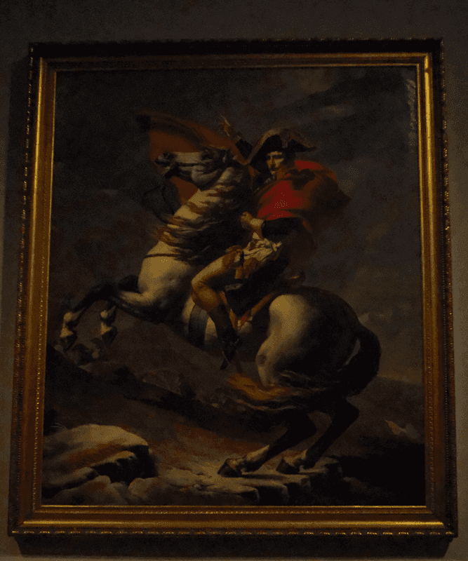

雖說已經對於歐洲景色的標準提高，但是維也納仍是非常美的城市，不難理解為什麼這裡會是歐洲曾經的文化重鎮。

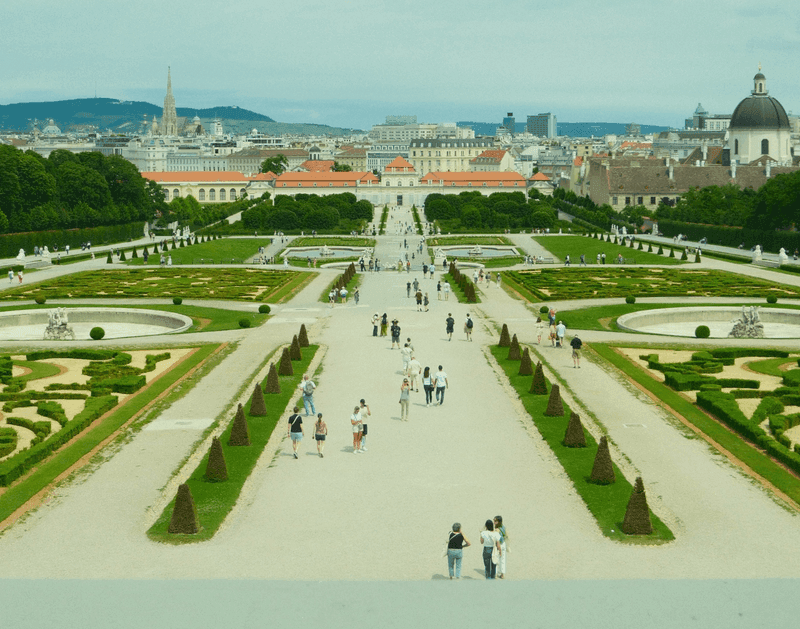

> 維也納美景宮：相機直出，像是畫一樣美的色調

### 越南 

> **🏨 住宿**：在離海岸約步行5分鐘的飯店，價格大約落在台幣 500 左右，就可以有一個很不錯的大套房。如果是包月的話，甚至可以找到更便宜的
>
> **🍲 食物**：落在 40 ~ 60 元/餐，我通常會找當地人的小吃店，價格便宜又好吃，很幸運的都沒有遇到肚子痛的問題
>
> **🚇 交通**：在峴港必須要有摩托車，或者叫當地的 uber，租車一天價格大概台幣 100 ~ 200 ，叫車的話 10 分鐘路程應該是 50 左右。行人交通的話大概跟其他東南亞國家差不多，必須自己想辦法過馬路，以及路上的喇叭聲確實也不少
>
> 🛡️ **安全**：因為我在比較觀光的區域，所以多數應該是安全的

#### 峴港

線港號稱是亞洲的夏威夷，有長長的白沙灘，還有清澈的海水。越南給我的總體印象就是「好吃」、「便宜」。恰好滿足我最需要的兩個條件，物價便宜可以降低生活成本，而食物的問題，之前在歐洲就領教過，我真的是亞洲胃，沒辦法連吃一個月的白人飯啊。

因為在沙灘附近，所以每天早上都可以去沙灘練習衝浪，這裡的海浪很適合新手，穩定而且固定流向。越南的天氣還是蠻炎熱的，所以最佳活動時間是早上五點左右，跟著日出一起出門活動，也有不少店家早上五六點就開始上班。

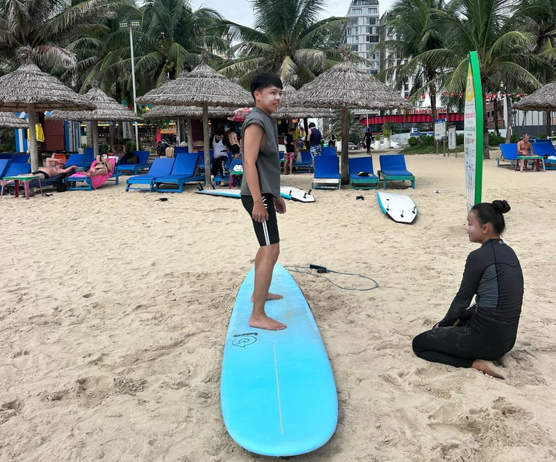

> 一個人出門的缺點大概是紀錄不方便吧。很難找到自己的照片XD

如果你有點預算的話，可以在這裡找到相當多不錯的咖啡廳。價格也是在 100 元左右，對於遠端工作者來說非常友善。

遠端辦公室也很便宜，有完善的網路跟螢幕，也是 100 元可以坐整天。

---
## ⭐ 今年最受用

**模仿理論**

如果說人類模仿的不只是行為，甚至是慾望也是從他人身上模仿來的。在模仿慾望的過程中，如果對象是我們的同儕，那可能會變成內部競爭，變成你只記得你們是在競爭，而忘了你當時的慾望到底是想要什麼。

如果對這個理論有興趣，我有寫過相關文章：

[🚪 模仿理論傳送門](/posts/mimetic_desire)

---
## ⭐ 今年最喜歡的動畫電影

**羅小黑戰記2**

羅小黑戰記我認為是今年最值得一看的動畫電影，在我心中也已經超過許多日本大師的作品（這部作品完全展示了中國的動畫無法阻擋的崛起）。優秀的畫風、流暢的打鬥、精彩的劇情。這些肯定是一部優秀電影的基本條件，但是我最喜歡的是羅小黑戰記的人物塑造。

角色非常的通人性，厲害的角色不會故意隱藏實力，被打退的敵人會乾脆認輸，即使是感覺內向的角色，在必要時也會用自己的方式坦露內心。

每個人物都給人非常「真實」的感覺，沒有那種幼稚的打打殺殺、你死我活，或是情感過於擰巴、掙扎的 emo 劇情。而是角色在各自的生活條件下，實實在在的、直接的、真實的價值觀選擇。

看完電影感覺自己完全可以喜歡上這個創作團隊裡的所有人，透過電影都能看見他們的真誠。

---
## ⭐ 今年最推薦的音樂

#### **FunkyMo：芭樂**

龐克、台客、搖滾集於一身，我在歐洲的街頭播放也絲毫不覺得違和，非常放鬆的一首歌

<YouTube id="rML9tw5qAaQ" />

#### 當代電影大師 Modern Cinema Master - 我知道你不敢聽 (Official Audio)

一直喜歡這種宣洩的因為，作為自我批評的達人，誰不喜歡聽呢？

<YouTube id="tIlW_j5eQ-s" />

---
## ⭐ 今年最推薦的書籍

### **湯質：關於說話的一切**
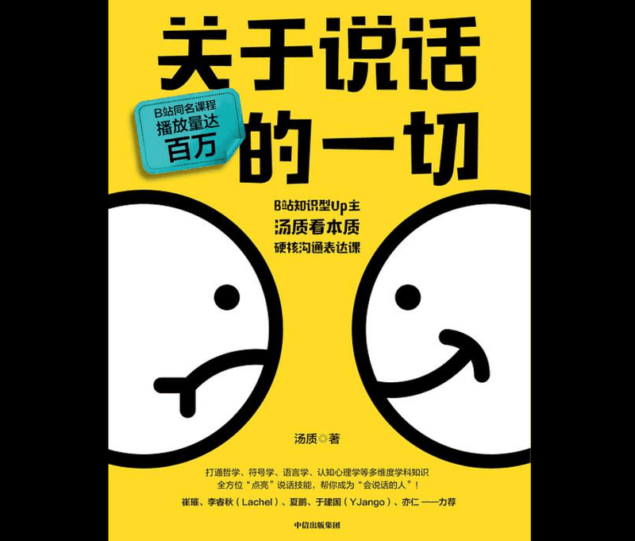

表面上是說關於說話的一切，但這不是一本教你怎麼說話的書，而是把「語言」是什麼這件事情說清楚。開頭第一篇就告訴你，你不會溝通可能不是技巧不好，而是你腦袋空空，所以自然說不出什麼有說服力的話。

這裡就可以看出整部作品的基調，他想告訴你的是，理解語言的本質、我們為什麼溝通等等。

在閱讀中，幾乎每個篇章我都能找到需要記錄的想法，好的閱讀就是能夠讓你產生很多不同的聯想，腦內組織的愉悅感。

### **你一生的預言**

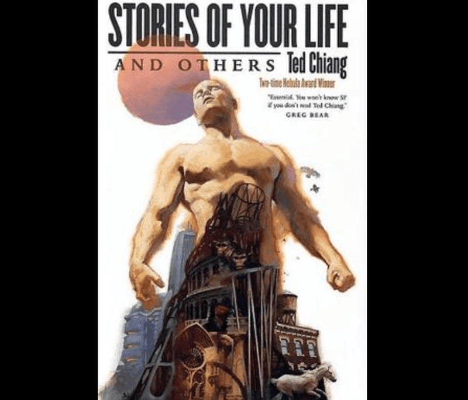

姜峯楠的小說集，裡面最有名的一篇就是標題的《你一生的預言》，電影異星入境的原著小說。很喜歡小說裡面對於語言代表思想的詮釋，以及對於「決定論」的思考。如果一切是注定的，那麼還有前進的必要嗎？

另外值得一提的是，這個段篇的閱讀體驗也十分新奇，在過程會不段穿插現在以及未來的畫面，但節奏掌握得非常好，不會讓閱讀感到疲倦或者疑惑。

---
## ⭐ 今年最推薦的漫畫

**孤高之人：坂本眞一**

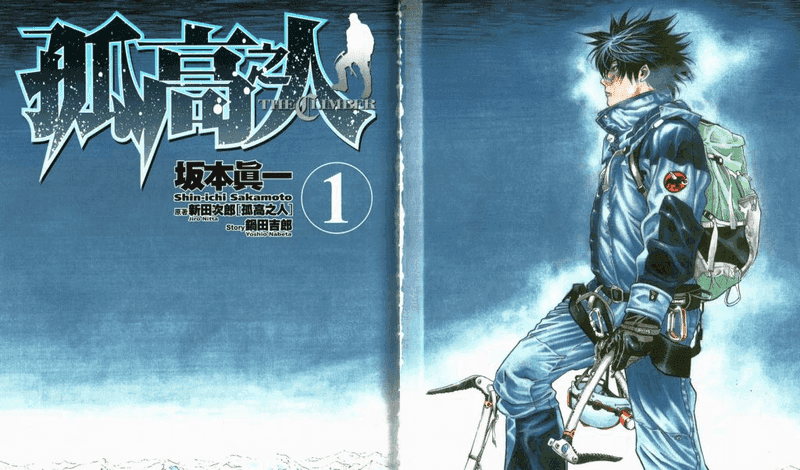

一個男孩要怎麼成長成為一個大人。如果你喜歡浪客行、烙印勇士，這種「真男人」養成系漫畫，那孤高之人絕對是必推的作品之一。

一個人對於目標的執著，這是任何真男人都抵擋不住的浪漫，老師的畫風也非常「飄逸」，能夠用各種抽象的畫面，帶入主角的孤獨、慾望、妥協、成長。

除了畫技值得讚賞外，我認為這部漫畫最值得稱讚的是各個章節之間的節奏把控，可以把每一個部分的故事與懸念都做得淋漓盡致，在連載的壓力下，還能把故事編排得如此有張力跟吸引力，不知道是老師的功力太強，還是編輯也下了苦功。比起浪客行和烙印勇士，對於初讀漫畫的人來說，這本更值得推薦。