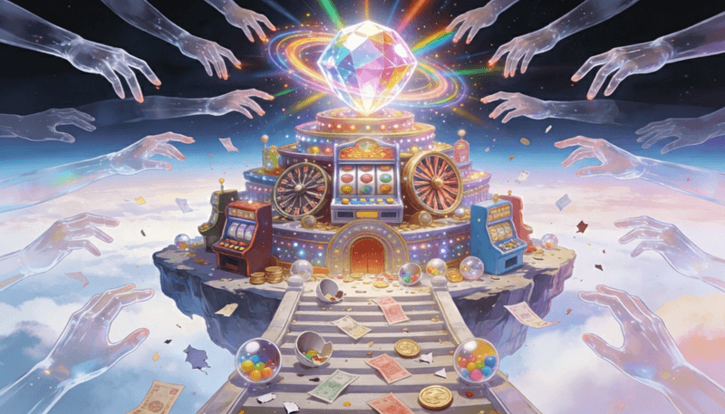

躺平的人大概是這樣想通的：既然努力不保證結果，那為什麼要努力？

他們看穿了某種幻象：「只要努力就會成功」的幻象。甚至可能會因此稍微沾沾自喜。

但同時，這也反映了這個時代的焦慮：「我努力，似乎也得不到我想要的結果。」

---

## 一、種瓜得瓜的世界

在農耕社會，因果關係很清晰。你播種、澆水、施肥、除草，然後收穫。投入和產出之間存在明確的對應。一分耕耘，一分收穫。

這種確定性延續到了考試制度。你讀書、做題、背誦，分數高就上好學校。規則透明，因果明確。整整幾代人就是這樣考上大學、找到工作、養活一家人的。

這套邏輯塑造了我們父母那一代人的世界觀。它告訴你：只要你願意付出，世界就會回報你。

問題是，這個確定性的世界正在慢慢崩塌。

---

## 二、確定性的崩塌

現在的世界長什麼樣？

你的競爭對手可能在地球另一端，用你聽不懂的語言，做著你還沒聽過的工作。規則一直 24 小時在變化，你甚至不確定自己在玩的是什麼遊戲。

更關鍵的是，成功的分配方式變了。

過去，資源的分配相對線性：努力越多，回報越多。但現在，分配變成了冪次法則：少數人拿走大部分，多數人分剩下的殘渣。

根據 2024 年的數據，美國最富有的 1% 家庭掌握了全國 30.5% 的財富，而底層 50% 的家庭只擁有 2.5% 的財富。金字塔頂端那 1% 的人，擁有的資源是底層一半人口總和的 12 倍。

「大亨小傳曲線（Gatsby Curve）」：一個社會的貧富差距越大，階層流動性就越低。富裕家庭的孩子更容易維持富裕，貧困家庭的孩子更難翻身。這不是個人努力的問題，而是結構性的鎖定。

當向上流動的梯子越來越窄，找不到確定性是我們這一代人最大的焦慮。

---

## 三、演算法的篩選

另一個演算法的現象：**你看到的「成功」，是被演算法篩選過的。**

這些「成功」故事被不斷放大、推送、傳播。因為它們夠戲劇化，夠能引發情緒反應。演算法愛死它們了。

但你沒看到的是什麼？

那一萬個同樣輟學但失敗的人。那十萬個努力拍片但從未被看見的創作者。那些默默耕耘、最後只得到平庸回報的大多數人。

他們不是不夠努力，也許只是不夠幸運。他們不會出現在你的動態牆上，因為他們的故事不夠刺激。

這無意間強化了另一個訊息：成功是隨機降臨的，而不是可預測的。

當人們開始相信成功是隨機的，一個微妙的心理轉變就發生了。

如果努力不保證結果，那為什麼要努力？不如把希望寄託在運氣上。

---

## 四、隨機性的誘惑

這解釋了很多現代的賭徒心態為什麼越來越嚴重。

- 手遊抽卡。玩家明知道機率極低，卻願意花大錢去抽。為什麼？因為那個「中獎」的瞬間，帶來的快感遠超過慢慢累積的成就感。更重要的是，它符合人們對成功的新認知：反正都是隨機的，抽卡和努力工作有什麼區別？

- 博弈產業的興盛。線上賭場、運彩、加密貨幣的投機交易。人們追求的是那個「一夜翻身」的可能性。

- 詐騙的盛行。詐騙之所以有效，是因為它利用了人們對「快速致富」的渴望。當人們不再相信穩定的因果關係，他們更容易被「捷徑」所吸引。

這些現象有一個共同點：**它們都在販賣隨機性的幻覺。**

---

## 五、幻覺底下的真相

成功的「表象」變得更隨機了，但成功的「本質」從未改變。

問題只是在於：演算法推送的是表象，而不是本質。

演算法餵給我們的是奇蹟，不是過程。我們看到的是中獎的那一刻，不是背後無數次的落空。這種資訊的偏差，讓我們對現實產生了扭曲的認知。

我們誤以為世界變得更隨機了，可能只是我們的資訊來源變得更偏頗了。

---

## 六、所以努力就會成功嗎？

義大利物理學家曾經做過一個有趣的電腦模擬：他們讓一千個虛擬人進行四十年的職涯競爭，每個人被賦予不同的「才華值」，並在過程中隨機遭遇好運或厄運。

結果發現，最終站在財富金字塔頂端的，幾乎從來不是才華最高的人，而是才華中等偏上、但運氣極好的人。

在複雜系統中，極端成功需要「才華作為門檻」加上「連續的好運氣」。才華讓你有資格上牌桌，但最後拿到什麼牌，有很大的隨機成分。

摩根大通的研究員 Michael J. Mauboussin 提到一個現象叫「技能悖論」：當一個領域的所有參與者技能都在提升，彼此差距越來越小時，運氣在決定勝負中的權重反而會上升。

就像當所有短跑選手的成績都擠在 0.1 秒內，誰能奪冠就更取決於當天的風向、起跑反應、甚至是當天的心情，這些隨機因素。

難道，努力真的沒有結果嗎？

---

## 七、重新理解努力

問題不在於「努力有沒有結果」這句話，而在於我們對「結果」的定義太狹隘了。

如果「結果」只意味著財富、名聲、世俗的成功，那確實，努力不保證這些東西。因為這些東西的分配受到太多你無法控制的因素影響：演算法、時機、運氣、你出生在哪個家庭。

但如果「結果」意味著別的東西呢？

你變得更有能力。你對一個領域有了更深的理解。你建立了可以信賴的關係。你更清楚自己是誰、想要什麼。

**這些結果，努力幾乎總是會帶來。**

它們不會被演算法奪走，不會因為運氣不好而消失，也不會因為別人的成功而貶值。

這聽起來像是雞湯式的自我安慰？但在不確定的人生中，我們能做的，就是建立自己的價值觀體系。

---

## 八、在不確定中前進

我們無法回到那個「種瓜得瓜」的確定世界。複雜性是現代社會的本質，不是可以消除的 bug。

但我們可以改變自己看待努力的方式。

**區分你能控制的和不能控制的。** 你能控制的是你的投入：學什麼、做什麼、和誰合作。你不能控制的是外界的反應：市場、演算法、運氣。把注意力放在前者，對後者保持平常心。

**建立長期的視角。** 短期來看，成功確實很隨機。但拉長時間軸，那些持續努力的人，平均而言會比不努力的人得到更好的結果。神經科學發現，當你強迫自己去做那些「不想做但必須做」的事情時，大腦中一個叫前扣帶皮層的區域會被激活並實際增長。這個區域與意志力和長期目標的追求密切相關。

**警惕隨機性的誘惑。** 當有人告訴你可以不勞而獲，那幾乎肯定是陷阱。無論是抽卡、賭博、還是任何「快速致富」的承諾，它們賣的都是幻覺。幻覺的代價，是你本可以用來真正成長的時間和資源。

